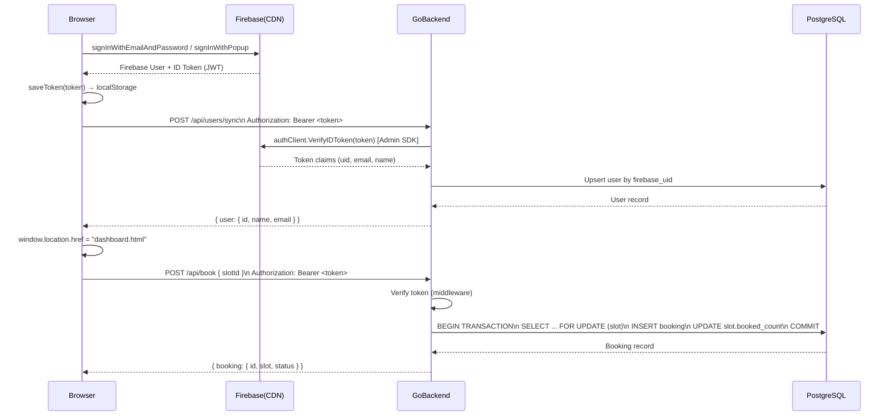

# Booking Application — Full Project Breakdown

A full-stack slot booking platform built with a **Go backend** and a **vanilla HTML/CSS/JS frontend**, using **Firebase Authentication** and **Neon PostgreSQL** as the database.

---

## 🗂️ Project Structure at a Glance

```
Booking-Application_GO/
├── backend/                   ← Go server
│   ├── main.go                ← Entry point
│   ├── .env                   ← Environment variables
│   ├── config/
│   │   ├── config.go          ← Loads env vars & initializes Firebase Admin SDK
│   │   └── firebase-service-account.json  ← Firebase service account credentials
│   ├── db/
│   │   ├── db.go              ← PostgreSQL connection via GORM
│   │   └── seed.go            ← Seeds initial slot data into the DB
│   ├── models/
│   │   ├── user.go            ← User struct (GORM model)
│   │   ├── slot.go            ← Slot struct (GORM model)
│   │   └── booking.go         ← Booking struct (GORM model + FK relations)
│   ├── middleware/
│   │   └── auth.go            ← Firebase JWT verification middleware
│   ├── handlers/
│   │   ├── response.go        ← Shared writeJSON / writeError helpers
│   │   ├── slots.go           ← GET /api/slots
│   │   ├── users.go           ← POST /api/users/sync (upsert user)
│   │   └── bookings.go        ← POST /api/book, GET /api/bookings
│   ├── routes/
│   │   └── routes.go          ← Chi router setup + CORS + middleware wiring
│   └── go.mod / go.sum        ← Go module dependencies
│
└── frontend/                  ← Static HTML/CSS/JS pages
    ├── index.html             ← Landing / home page
    ├── auth.html              ← Login / Signup page
    ├── slots.html             ← Browse available slots
    ├── booking.html           ← Book a specific slot
    ├── dashboard.html         ← User's confirmed bookings
    ├── css/
    │   └── style.css          ← Global stylesheet
    └── js/
        ├── firebase-config.js ← Firebase SDK init + shared auth helpers
        ├── auth.js            ← Login/signup/Google OAuth logic
        ├── slots.js           ← Fetch & render available slots
        ├── booking.js         ← Book a slot (auth-gated)
        └── dashboard.js       ← View own bookings (auth-gated)
```

---

## 🔧 Backend — Go Server

### Entry Point (`main.go`)

The startup sequence is:

```
1. config.Load()         → reads .env, inits Firebase Admin SDK
2. database.Connect()    → opens PostgreSQL connection via GORM
3. db.AutoMigrate()      → creates/updates tables for User, Slot, Booking
4. database.SeedSlots()  → inserts sample slots if the table is empty
5. routes.NewRouter()    → builds the Chi HTTP router
6. http.ListenAndServe() → starts server on port 8080
```

### Configuration (`config/config.go`)

Reads three environment variables from `.env` via `godotenv`:

| Variable | Value |
|---|---|
| `PORT` | `8080` (default) |
| `DATABASE_URL` | Neon PostgreSQL connection string |
| `FIREBASE_CREDENTIALS_PATH` | `./config/firebase-service-account.json` |

After loading, it initializes the **Firebase Admin SDK** using the service account JSON file, then creates an `auth.Client` that is passed into the middleware.

---

## 🗄️ Database — Neon PostgreSQL + GORM

The database is a **cloud-hosted PostgreSQL** instance on [Neon](https://neon.tech/). The connection string includes SSL (`sslmode=require`). GORM is used as the ORM.

### Tables / Models

#### `users`
| Column | Type | Notes |
|---|---|---|
| `id` | uint (PK) | Auto-increment |
| `firebase_uid` | string | Unique index, not null — links to Firebase identity |
| `name` | string | User's display name |
| `email` | string | Indexed |
| `created_at` | time.Time | Auto-set by GORM |

#### `slots`
| Column | Type | Notes |
|---|---|---|
| `id` | uint (PK) | Auto-increment |
| `date` | string | e.g., `"2026-06-20"` |
| `time` | string | e.g., `"10:00 AM"` |
| `capacity` | int | Max people allowed |
| `booked_count` | int | How many have booked (default 0) |

#### `bookings`
| Column | Type | Notes |
|---|---|---|
| `id` | uint (PK) | Auto-increment |
| `user_id` | uint (FK → users) | Indexed |
| `slot_id` | uint (FK → slots) | Indexed |
| `status` | string | Default `"confirmed"` |
| `created_at` | time.Time | Auto-set |
| `user` | User | Preloaded via GORM relation (CASCADE) |
| `slot` | Slot | Preloaded via GORM relation (CASCADE) |

### Seeding (`db/seed.go`)

On every startup, the app checks if the `slots` table is empty. If it is, it inserts **5 hardcoded slots** across 3 dates (June 20–22, 2026) with various capacities.

---

## 🔐 Middleware — Firebase JWT Auth (`middleware/auth.go`)

This is a standard **HTTP middleware** that wraps protected routes.

**How it works:**

```
Request →  Read "Authorization" header
       →  Validate "Bearer <token>" format
       →  Call authClient.VerifyIDToken(token)   [Firebase Admin SDK]
       →  On success: inject UID, email, name into request context
       →  On failure: return 401 Unauthorized
       →  Pass request to next handler
```

**Context helpers** (used by handlers):

| Function | Returns |
|---|---|
| `middleware.FirebaseUID(ctx)` | The verified Firebase UID string |
| `middleware.Email(ctx)` | The user's email from the token claims |
| `middleware.Name(ctx)` | The user's display name from the token claims |

---

## 🌐 API Routes (`routes/routes.go`)

Built with the **Chi** router. Global middleware stack applied to all routes:

| Middleware | Purpose |
|---|---|
| `middleware.RequestID` | Attaches a unique ID to every request |
| `middleware.RealIP` | Extracts real client IP from headers |
| `middleware.Logger` | Logs each request to stdout |
| `middleware.Recoverer` | Catches panics and returns 500 |
| `cors.Handler` | Allows requests from `localhost:3000` and `127.0.0.1:5500` |

### Public Routes (no auth required)

| Method | Path | Handler | Description |
|---|---|---|---|
| `GET` | `/api/health` | inline | Returns `{"status":"ok"}` |
| `GET` | `/api/slots` | `SlotsHandler.List` | Returns all non-full slots |

### Protected Routes (require Firebase Bearer token)

| Method | Path | Handler | Description |
|---|---|---|---|
| `POST` | `/api/users/sync` | `UsersHandler.Sync` | Create or update user in DB |
| `POST` | `/api/book` | `BookingsHandler.Create` | Book a slot |
| `GET` | `/api/bookings` | `BookingsHandler.List` | Get current user's bookings |

---

## 📦 Handlers

### `handlers/slots.go` — `GET /api/slots`

Queries the DB for all slots where `booked_count < capacity`, ordered by date and time. Returns `{"slots": [...]}`. **No auth required** — anyone can see available slots.

### `handlers/users.go` — `POST /api/users/sync`

Called immediately after login. It:
1. Reads `firebase_uid` from context (set by middleware)
2. Checks if user exists in DB
3. **If found:** updates `name`/`email` if they changed
4. **If not found:** creates a new `User` row
5. Returns the user record as JSON

This is the "upsert" pattern — ensures every Firebase user has a corresponding DB row.

### `handlers/bookings.go` — `POST /api/book` & `GET /api/bookings`

**Create Booking (`POST /api/book`):**

Runs entirely inside a **database transaction** with row-level locking:

```
1. Look up the User by firebase_uid
2. Lock the Slot row with SELECT FOR UPDATE (prevents double-booking)
3. Check slot.booked_count < slot.capacity — if full, return 409 Conflict
4. Create the Booking record
5. Increment slot.booked_count
6. Preload and return the booking with slot details
```

The `slotId` field in the request body flexibly accepts both a **number** and a **numeric string** (handled by `parseUintField`).

**List Bookings (`GET /api/bookings`):**

1. Look up the User by firebase_uid
2. Fetch all Bookings for that user, preloading the Slot
3. Returns `{"bookings": [...]}` ordered by `created_at desc`

---

## 🖥️ Frontend — Vanilla HTML/CSS/JS

The frontend is **static** — no build step, no framework. It's served directly from the filesystem or a simple HTTP server (e.g., VS Code Live Server on port 5500).

### Pages

| File | JS File | Purpose |
|---|---|---|
| `index.html` | — | Landing page / home |
| `auth.html` | `auth.js` | Login, signup, Google OAuth |
| `slots.html` | `slots.js` | Browse available slots |
| `booking.html` | `booking.js` | Confirm & submit a booking |
| `dashboard.html` | `dashboard.js` | View user's own bookings |

### `firebase-config.js` — The Shared Auth Core

This is the **central module** imported by all other JS files. It:

- Initializes the **Firebase JS SDK v9** (loaded via CDN from `gstatic.com`)
- Exports `auth`, `googleProvider`, and `app`
- Manages the `firebaseIdToken` in `localStorage`
- Exports helper functions:

| Function | Description |
|---|---|
| `saveToken(token)` | Saves token to localStorage |
| `clearToken()` | Removes token from localStorage |
| `getStoredToken()` | Reads token from localStorage |
| `getFreshIdToken()` | Forces a fresh token from Firebase (handles expiry) |
| `waitForAuthUser()` | Waits for Firebase auth state to resolve |
| `loginWithEmail(email, pw)` | Firebase email/password sign-in |
| `signupWithEmail(email, pw)` | Firebase email/password registration |
| `loginWithGoogle()` | Firebase Google OAuth popup |
| `logoutUser()` | Firebase sign-out + clears token |
| `syncBackendUser(user)` | Calls `POST /api/users/sync` with Bearer token |

An `onAuthStateChanged` listener runs globally: on sign-in it refreshes and saves the token; on sign-out it clears it.

### `auth.js` — Login / Signup Page

- Supports toggling between **Login** and **Sign Up** modes
- On email form submit → calls `loginWithEmail` or `signupWithEmail` → then `syncBackendUser` → redirects to `dashboard.html`
- Google button → calls `loginWithGoogle` → then `syncBackendUser` → redirects to `dashboard.html`
- Logout button → calls `logoutUser`

### `slots.js` — Available Slots

- On load, calls `GET /api/slots` (no auth needed)
- Renders each slot as an `<article class="slot-card">` with date, time, and a "Book" link
- The "Book" link navigates to `booking.html?slotId=<id>`
- Has a Refresh button to re-fetch slots

### `booking.js` — Booking Page

- On load, fetches all slots and populates a `<select>` dropdown
- Reads `?slotId=` from the URL query string and pre-selects that option
- On form submit:
  1. Calls `getFreshIdToken()` to get a valid JWT
  2. POSTs `{ slotId }` to `POST /api/book` with `Authorization: Bearer <token>`
  3. Shows success/error status

### `dashboard.js` — User Dashboard

- On load, calls `waitForAuthUser()` — if not signed in, redirects to `auth.html`
- Fetches `GET /api/bookings` with the user's Bearer token
- Renders each booking as a `<article class="booking-card">` showing status, date, and slot time
- Logout button calls `logoutUser()` and redirects to `auth.html`

---

## 🔑 Authentication Flow (End-to-End)



---

## 📦 Key Dependencies

### Backend (Go)

| Package | Purpose |
|---|---|
| `go-chi/chi/v5` | HTTP router |
| `go-chi/cors` | CORS handler |
| `gorm.io/gorm` | ORM |
| `gorm.io/driver/postgres` | PostgreSQL GORM driver (uses pgx) |
| `firebase.google.com/go/v4` | Firebase Admin SDK (token verification) |
| `google.golang.org/api` | Google API client (Firebase dependency) |
| `joho/godotenv` | Load `.env` files |

### Frontend (CDN)

| Package | Version | Purpose |
|---|---|---|
| Firebase JS SDK | 9.23.0 | Auth (email, Google OAuth, token management) |

---

## ⚠️ Notable Design Decisions & Gotchas

1. **Concurrency Safety**: The `POST /api/book` handler uses `SELECT FOR UPDATE` (`clause.Locking{Strength: "UPDATE"}`) inside a transaction — this prevents two simultaneous requests from double-booking the last slot.

2. **Token Freshness**: `getFreshIdToken()` always calls `auth.currentUser.getIdToken()` (which Firebase auto-refreshes if expired), rather than using the cached localStorage value. This prevents 401 errors on expired tokens.

3. **CORS Restriction**: Only `localhost:3000` and `127.0.0.1:5500` are allowed. The `:5500` origin corresponds to VS Code's Live Server extension.

4. **Flexible `slotId` Parsing**: `parseUintField()` accepts the slot ID as either a JSON number or a JSON string — this handles the browser's default behavior of sending form values as strings.

5. **User Sync on Every Login**: `syncBackendUser` is called after every successful login. This ensures that if a user updates their name in Google, it stays in sync with the local DB.

6. **DB Seeding is Idempotent**: `SeedSlots()` checks if any slots exist before inserting — safe to call on every startup.

7. **No Session / Cookies**: The app is entirely stateless on the backend. Auth state lives in Firebase on the client, and the JWT is stored in `localStorage`. The backend verifies the token on every protected request.
